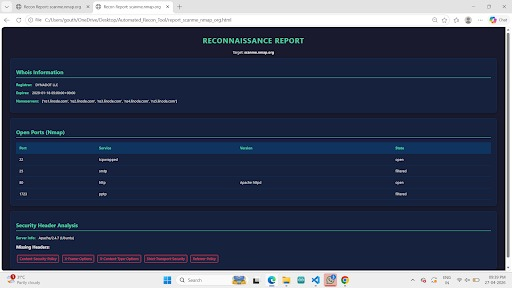

# Automated Recon Tool (ART) 🛡️

A modular Python-based CLI tool designed to automate the reconnaissance phase of a penetration test. ART chains multiple intelligence-gathering techniques into a single workflow, producing a professional, stakeholder-ready HTML dashboard.

## 🚀 Features
- **Passive Recon:** Automated WHOIS lookup and DNS enumeration (A, MX, TXT records).
- **Active Discovery:** Port scanning and service version detection using the Nmap engine.
- **Web Security Audit:** HTTP security header analysis to identify missing protections (CSP, HSTS, X-Frame-Options).
- **Professional Reporting:** Generates unique JSON data logs and a Dark-Mode HTML dashboard for every scan.

## 🛠️ Architecture
Built using a modular **MVC-inspired** pattern to ensure scalability and clean code:
- **Python Core:** Orchestrates data flow between modules.
- **Jinja2:** Handles the dynamic rendering of the security reports.
- **Nmap Wrapper:** Interfaces with system-level network scanners.

## 📦 Installation
1. Install Nmap on your system.
2. Clone the repository:
   ```bash
   https://github.com/gouthami-tammishetti/Automated_Recon_Tool.git
   cd Automated_Recon_Tool

## 📊 Sample Output

